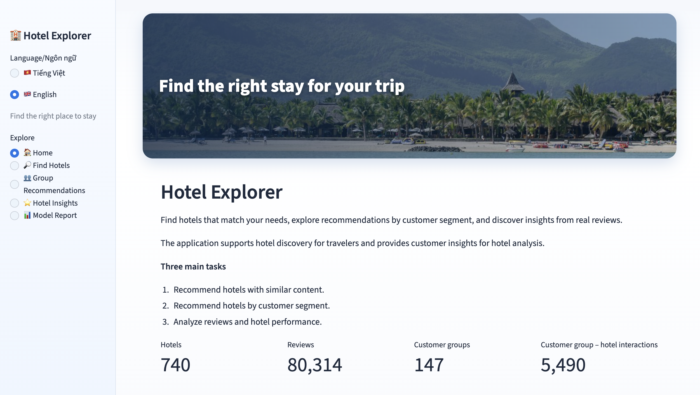
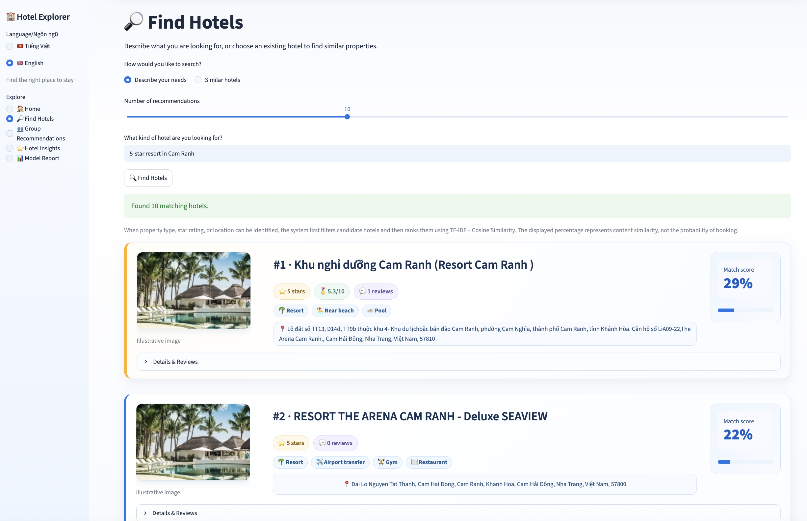
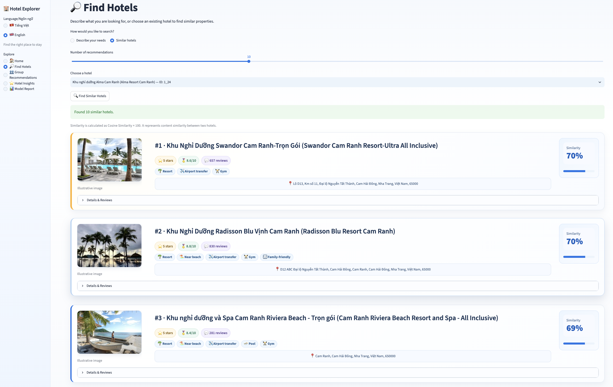
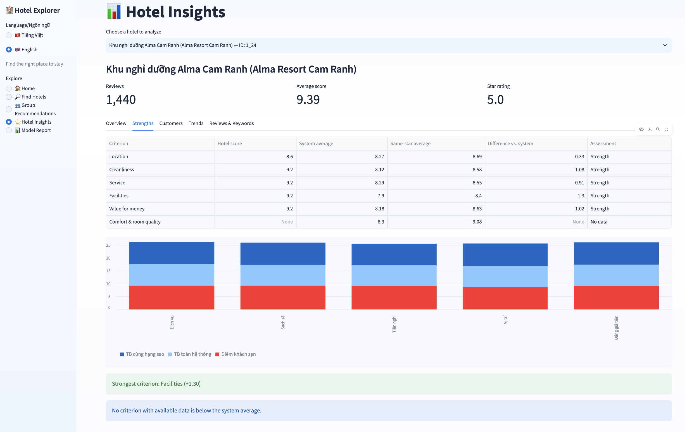
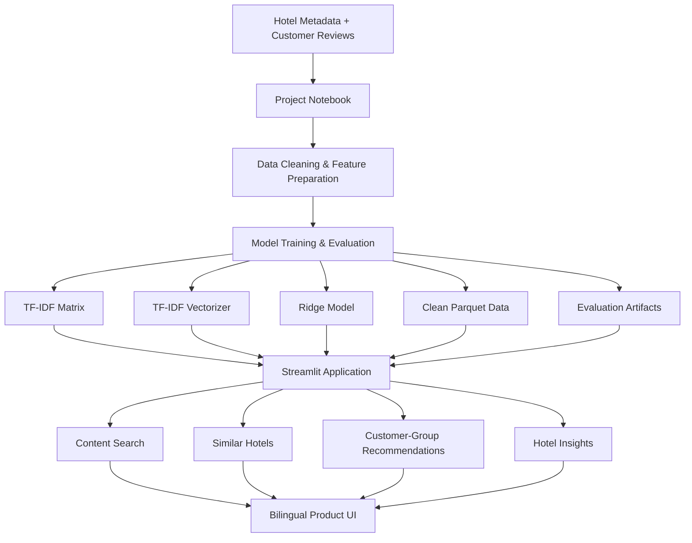

# Hotel Recommendation & Customer Insights

An end-to-end machine learning project for **hotel discovery, recommendation, and customer review analytics**, delivered through an interactive Streamlit application.

The project combines **content-based recommendation**, **customer-group recommendation**, and **hotel-level insights** in a user-friendly bilingual interface supporting Vietnamese and English.

**Live Demo:** [hotel-recommendation-insights.streamlit.app](https://hotel-recommendation-insights.streamlit.app/)



---

## Overview

Hotel platforms contain large amounts of property information and customer feedback, making it difficult for users to quickly identify suitable hotels and for hotel operators to extract useful insights from reviews.

This project addresses three main tasks:

1. **Find hotels based on user needs** using free-text search.
2. **Recommend hotels for customer segments** based on historical review interactions.
3. **Analyze hotel performance and customer feedback** through review-based insights.

The complete modeling workflow is available in [`notebook/hotel_recommendation_modeling_and_evaluation.ipynb`](notebook/hotel_recommendation_modeling_and_evaluation.ipynb).

It covers data preparation, exploratory analysis, model training, evaluation, hotel insights, and deployment artifact generation.

---

## Application Features

### Hotel Search

Users can describe what they are looking for using natural text such as:

```text
5-star resort in Cam Ranh
hotel near airport
căn hộ Cam Ranh
resort gần biển
```

The application uses a hybrid content-search approach:

1. Detect recognizable conditions such as property type, star rating, and location.
2. Filter the hotel catalog when these conditions are available.
3. Rank remaining candidates using **TF-IDF + Cosine Similarity**.

The displayed match percentage represents **content similarity**, not the probability that a customer will book the hotel.



### Similar Hotels

Users can select an existing hotel and retrieve similar properties using **TF-IDF vectors and Cosine Similarity**.

This mode focuses on similarity between hotel content rather than user behavior.



### Customer-Group Recommendations

The application also provides recommendations for customer segments defined from attributes such as nationality and travel group.

The production application uses:

**One-Hot Encoding + Ridge Regression**

The model predicts hotel ratings for unseen customer-group/hotel combinations and ranks the highest-scoring hotels.

Because each reviewer in the available data has only one interaction, this feature operates at the **customer-group level rather than individual-user personalization**.

### Hotel Insights

For hotels with review data, the application provides:

- review count and average rating;
- detailed rating criteria;
- comparison with system-wide and same-star averages;
- customer nationality and travel-group summaries;
- review trends over time;
- frequent review keywords;
- highest- and lowest-scoring reviews.

Keyword analysis is used to identify topics worth investigating rather than automatically classifying every keyword as a strength or weakness.



### Vietnamese / English UI

The Streamlit interface supports both **Vietnamese and English**.

Hotel names, addresses, descriptions, customer reviews, and other raw source values are intentionally preserved rather than automatically translated.

### Product-Style Hotel Cards

Recommendations are displayed as hotel cards with:

- representative accommodation images;
- hotel metadata and highlights;
- recommendation or predicted score;
- Google Maps search links;
- expandable rating details and customer reviews.

The accommodation images are **representative/illustrative images and are not actual photographs of the listed hotels**.

---

## Dataset Summary

The deployment artifacts currently contain:

| Dataset / Entity | Count |
|---|---:|
| Hotels | 740 |
| Hotel reviews | 80,314 |
| Hotels with review data | 341 |
| Customer groups | 147 |
| Customer-group / hotel interactions | 5,490 |
| Hotels available to the collaborative model | 251 |

The project works with two primary types of information:

- **Hotel information** — property metadata, address, star rating, descriptions, and detailed rating criteria.
- **Hotel reviews** — customer ratings, nationality, travel group, review text, and review dates.

Cleaned datasets and trained model artifacts are exported from the project notebook for use by the Streamlit application.

---

## Machine Learning Approaches

### 1. Content-Based Recommendation

The content-based pipeline represents hotel information using **TF-IDF** and calculates similarity using **Cosine Similarity**.

The hotel representation combines descriptive information relevant to recommendation, while the application adds lightweight query parsing for recognizable hotel attributes.

Two content-based approaches were explored during model development:

- TF-IDF + Cosine Similarity
- Gensim-based similarity

For the sample evaluation used in the deployment artifacts, the two approaches shared **5 of the Top-10 recommendations**.

TF-IDF + Cosine Similarity was selected as the primary application approach because it is simple, interpretable, fast to deploy, and supports free-text query vectorization directly.

### 2. Customer-Group Recommendation

Three approaches were evaluated:

| Model | RMSE | MAE | Coverage |
|---|---:|---:|---:|
| Global Mean Baseline | 0.8604 | 0.6800 | 100% |
| PySpark ALS | 0.9197 | 0.7081 | 100% |
| **One-Hot + Ridge** | **0.8260** | **0.6307** | **100%** |

**One-Hot + Ridge Regression** achieved the lowest RMSE and MAE in this experiment and is therefore used by the Streamlit application.

**PySpark ALS** remains part of the notebook modeling and evaluation workflow as the distributed collaborative-filtering approach used for the Big Data component of the project. It is not executed directly inside the Streamlit application.

---

## Evaluation Notes

The project deliberately avoids reporting Precision@K or Recall@K because the available data does not contain a recommendation ground truth showing which unseen hotels each user or customer group should have selected.

Instead:

- content-based approaches are compared through recommendation overlap and qualitative inspection;
- collaborative models are evaluated using **RMSE**, **MAE**, and prediction coverage;
- recommendation outputs are interpreted together with the known limitations of the dataset.

Similarity and predicted-rating scores should not be interpreted as booking probabilities.

---

## Architecture



At runtime, the Streamlit application loads precomputed artifacts rather than retraining the machine learning models.

---

## Project Structure

```text
hotel-recommendation-customer-insights/
│
├── app.py
│
├── notebook/
│   └── hotel_recommendation_modeling_and_evaluation.ipynb
│
├── docs/
│   └── images/
│       ├── app-home.png
│       ├── hotel-search.png
│       ├── hotel-similar.png
│       └── hotel-insights.png
│
├── artifacts/
│   ├── hotel_info_clean.parquet
│   ├── hotel_comments_clean.parquet
│   ├── cf_data.parquet
│   ├── tfidf_matrix.npz
│   ├── tfidf_vectorizer.joblib
│   ├── ridge_full_model.joblib
│   ├── model_comparison.csv
│   └── deployment_summary.json
│
├── assets/
│   ├── hero/
│   ├── hotel_images/
│   ├── image_sources.csv
│   └── styles.css
│
├── scripts/
│   └── download_hotel_images.py
│
├── src/
│   ├── i18n.py
│   ├── image_helpers.py
│   ├── insights.py
│   ├── loaders.py
│   ├── recommenders.py
│   ├── ui_components.py
│   ├── ui_helpers.py
│   └── ui_theme.py
│
├── tests/
│   └── test_i18n.py
│
├── requirements.txt
└── README.md
```

The separation between notebook-generated artifacts and runtime application modules keeps the Streamlit deployment lightweight and avoids retraining models whenever the application starts.

---

## Running Locally

### 1. Clone the repository

```bash
git clone https://github.com/khoa8/hotel-recommendation-customer-insights.git
cd hotel-recommendation-customer-insights
```

### 2. Create a virtual environment

```bash
python -m venv .venv
```

macOS / Linux:

```bash
source .venv/bin/activate
```

Windows:

```powershell
.venv\Scripts\activate
```

### 3. Install dependencies

```bash
pip install -r requirements.txt
```

### 4. Start the application

```bash
streamlit run app.py
```

The application uses the model and data artifacts already included in the repository.

A Pexels API key is **not required to run the application**. `PEXELS_API_KEY` is only needed when intentionally regenerating the representative image assets with `scripts/download_hotel_images.py`.

---

## Tests

Run the current unit tests with:

```bash
python -m unittest discover -s tests -v
```

A basic syntax check can also be performed with:

```bash
python -m py_compile app.py src/*.py scripts/*.py
```

---

## Important Limitations

- Each Reviewer ID contains only one interaction, making reliable individual-level collaborative filtering impractical with the available data.
- Collaborative recommendations therefore operate at the **customer-group level**.
- Some Hotel IDs are not perfectly aligned between the hotel-information and review datasets.
- The dataset does not contain recommendation ground truth, so Precision@K and Recall@K are not reported.
- Content similarity measures how closely hotel information matches a query or another hotel; it does not estimate booking probability.
- Customer-group scores are predicted model ratings, not booking probabilities.
- Representative hotel images are used for presentation and do not depict the actual listed properties.

---

## Image Credits

Representative hotel and hero images were sourced from **Pexels** for presentation purposes.

Image provenance — including Pexels photo IDs, photographers, photographer pages, and source pages — is recorded in:

```text
assets/image_sources.csv
```

The application downloads no images from the Pexels API at runtime. Image assets are stored locally and mapped deterministically to hotels.

---

## Tech Stack

**Application**

- Python
- Streamlit
- Pandas
- NumPy

**Machine Learning**

- scikit-learn
- TF-IDF
- Cosine Similarity
- Ridge Regression

**Big Data / Model Comparison**

- PySpark
- ALS
- Gensim

**Deployment & Artifacts**

- Parquet
- SciPy sparse matrices
- Joblib
- Streamlit Community Cloud

---

## Data Source

The project uses hotel metadata and customer review datasets provided for the Big Data in Machine Learning course project.

The datasets include hotel information, ratings, customer attributes, and review text used for academic and portfolio purposes.

Third-party dataset ownership and licensing remain with the original data provider.